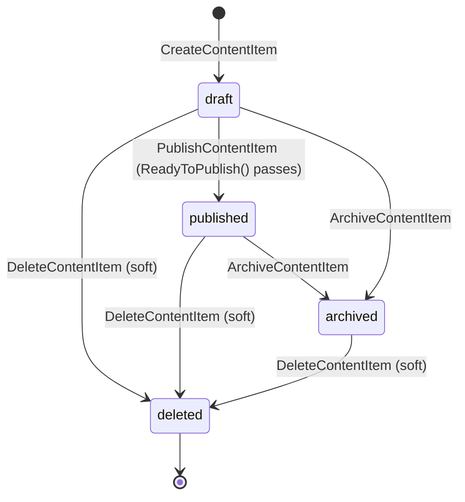

# Content Module

This document describes the architecture of `backend/internal/content` (Phase 3): the content
item lifecycle, the public vs admin HTTP contract, and the event flow triggered on publish. The
module mirrors `backend/internal/courses` (see [courses_module.md](courses_module.md)) field for
field — same clean-architecture layering, same lifecycle shape, same shared-repository plumbing.

Sources:
- [backend/internal/content](/Users/vitaliy/Documents/GitHub/learnflow/backend/internal/content)
- [backend/cmd/api/router](/Users/vitaliy/Documents/GitHub/learnflow/backend/cmd/api/router)

## Overview

The `content` module owns learning content items (video, book, presentation) in
draft/published/archived state, plus SEO metadata for their standalone pages. It follows the
standard clean-architecture layering: `transport/http` → `service` → `repository` → `domain`.

Unlike courses, a content item also carries a `content_type` (`video` | `book` | `presentation`)
which gates which media field is required to publish (`video_url`, `body`, or `file_url`
respectively) — see `checkMediaReady` in `domain/models.go`.

## Content item lifecycle



A content item can only move `draft → published` if `ContentItem.ReadyToPublish()`
(`domain/models.go`) passes — it requires non-empty `title`, `description`, `thumbnail_url`,
`seo_title`, `seo_description`, and the media field matching `content_type` (`video_url` for
`video`, `body` for `book`, `file_url` for `presentation`). This is enforced in
`service.PublishContentItem` before the repository update runs.

`DeleteContentItem` is a soft delete (`deleted_at` set, per project convention) and is reachable
from any status. It is terminal: no code path un-deletes a content item.

Migration `000009` sets `content_items.status` to default `'draft'` at the DB level, mirroring
migration `000007` for `courses.status`.

## Admin vs public contract

Routes are registered in `transport/http/http.go` `RegisterRoutes`, wired in
`cmd/api/router/router.go`:

| Method + path | Chain | Handler | Service call |
|---|---|---|---|
| `GET /api/v1/content` | `staticChain` | `listContentItems` | `GetAllContentItems(ctx, PublishedStatus)` |
| `GET /api/v1/content/{slug}` | `staticChain` | `getContentItemBySlug` | `GetContentItemBySlug` |
| `GET /api/v1/admin/content` | `adminChain` | `listAllContentItems` | `GetAllContentItems(ctx, status)` (`status` from `?status=` query, empty = all) |
| `POST /api/v1/admin/content` | `adminChain` | `createContentItem` | `CreateContentItem` |
| `PUT /api/v1/admin/content` | `adminChain` | `updateContentItem` | `UpdateContentItem` |
| `PUT /api/v1/admin/content/{id}/publish` | `adminChain` | `publishContentItem` | `PublishContentItem` |
| `PUT /api/v1/admin/content/{id}/archive` | `adminChain` | `archiveContentItem` | `ArchiveContentItem` |
| `DELETE /api/v1/admin/content/{id}` | `adminChain` | `deleteContentItem` | `DeleteContentItem` |

`staticChain` = `chains.Static` — same chain used for courses' public routes (rate-limited, no
auth required).

`adminChain` = `adminStaticWithAuth` = `chains.StaticWithAuth.Append(route.RequireRole(
authdomain.RoleAdmin, authdomain.RoleSubAdmin))` (`router.go`) — the same admin chain instance
courses uses, rejecting with 403 any authenticated user whose role isn't `admin`/`subadmin`.

There is no admin "get single content item by ID" route — only list-all (`GET
/api/v1/admin/content`) and public get-by-slug exist, matching CONT-02's "single material view"
requirement; add one if a future admin UI needs direct by-ID lookup.

## Event flow (PublishContentItem)

```
PUT /api/v1/admin/content/{id}/publish
  → service.PublishContentItem (inside Transactor.InTransaction)
      → repo.GetContentItemByID
      → contentItem.ReadyToPublish()
      → repo.PublishContentItem (UPDATE content_items SET status='published', published_at=now())
      → outbox.Emit(AggregationTypeNotification, contentItemID, EventNotificationSend, payload)
          — same DB transaction as the update above (transactional outbox)
  → event_outbox row (status='pending')
  → background worker polls event_outbox, publishes to Redis
  → (no consumer yet — see below)
```

`payload` (`events.NotificationSendPayload`) carries the content item `title` and `description` —
see `backend/internal/content/service/publish_content.go`. The `Template` field is left empty with
a `TODO(notifications module, Phase 3+)` comment: there is no notifications module yet to define a
template or recipients for, so the event is emitted (transactionally correct) but currently has no
consumer — same open item as courses' publish event.

## Shared plumbing

Both `content` and `courses` (and `auth`/`users`) build on the same `internal/shared/repository`
package (`BaseRepository`, generic `GetAndParseList[T]`, `ExecUpdateByID`) and
`internal/shared/validator` optional-field helpers (`RequireOptionalContentDescription`,
`RequireOptionalSeoTitle`, `RequireOptionalHTTPSURL`, etc.) — content was the first module built
directly on this shared layer; courses/auth/users were refactored onto it afterward.

## Known open items

- No `GET /api/v1/admin/content/{id}` — only list-all and get-by-slug (see above).
- `PublishContentItem`'s notification payload has an empty `Template` — no consumer until the
  notifications module lands.
- `RegisterContentRoutes` (`content.go`) still has a stray `courseHandler` variable name (copy-paste
  from `courses.go`) — cosmetic only, does not affect behavior.
