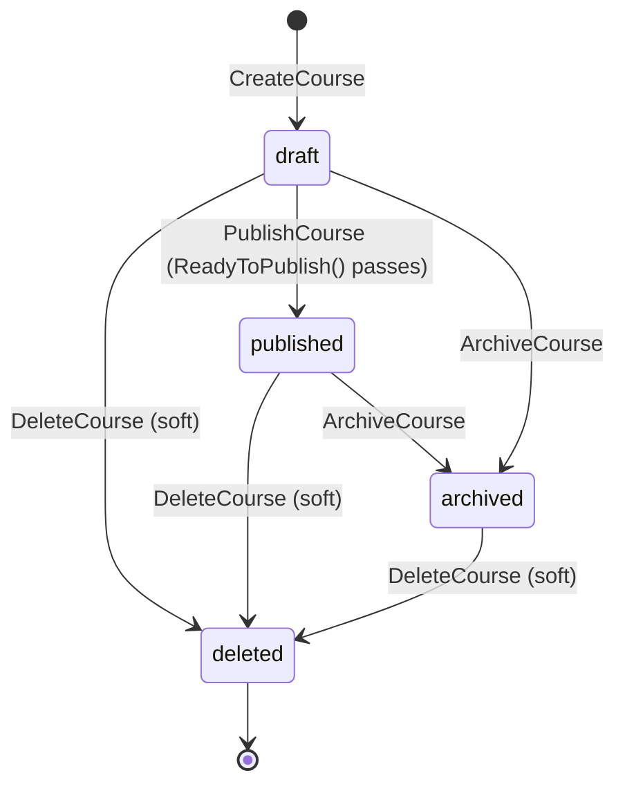

# Courses Module

This document describes the architecture of `backend/internal/courses` (Phase 3): the course
lifecycle, the public vs admin HTTP contract, and the event flow triggered on publish.

Sources:
- [backend/internal/courses](/Users/vitaliy/Documents/GitHub/learnflow/backend/internal/courses)
- [backend/cmd/api/router](/Users/vitaliy/Documents/GitHub/learnflow/backend/cmd/api/router)
- [SARCH-REVIEW-COURSES.md](/Users/vitaliy/Documents/GitHub/learnflow/SARCH-REVIEW-COURSES.md) — outstanding review findings

## Overview

The `courses` module owns courses in draft/published/archived state, their landing-page content
(SEO metadata, thumbnails, preview video), and (in later phases) reviews & ratings. It follows the
standard clean-architecture layering: `transport/http` → `service` → `repository` → `domain`.

## Course lifecycle



A course can only move `draft → published` if `Course.ReadyToPublish()`
(`domain/models.go:50-67`) passes — it requires non-empty `title`, `description`, at least one of
`thumbnail_url`/`preview_video_url`, `seo_title`, and `seo_description`. This is enforced in
`service.PublishCourse` before the repository update runs.

`DeleteCourse` is a soft delete (`deleted_at` set, per project convention) and is reachable from
any status. It is terminal: no code path un-deletes a course.

The DB enforces `courses_published_requires_published_at`: a course cannot be `published` without a
`published_at` timestamp — the repository sets both atomically in `publishCourseSQL`.

## Admin vs public contract

Routes are registered in `transport/http/http.go` with two `alice.Chain` values, wired in
`cmd/api/router/router.go`:

| Method + path | Chain | Handler | Service call |
|---|---|---|---|
| `GET /api/v1/courses` | `chain` | `listCourses` | `GetAllCourses(ctx, PublishedStatus)` |
| `GET /api/v1/courses/{slug}` | `chain` | `getCourseBySlug` | `GetCourseBySlug` |
| `GET /api/v1/admin/courses` | `adminChain` | `listAllCourses` | `GetAllCourses(ctx, status)` (`status` from `?status=` query, empty = all) |
| `POST /api/v1/admin/courses` | `adminChain` | `createCourse` | `CreateCourse` |
| `PUT /api/v1/admin/courses/{id}` | `adminChain` | `updateCourse` | `UpdateCourse` |
| `PUT /api/v1/admin/courses/{id}/publish` | `adminChain` | `publishCourse` | `PublishCourse` |
| `PUT /api/v1/admin/courses/{id}/archive` | `adminChain` | `archiveCourse` | `ArchiveCourse` |
| `DELETE /api/v1/admin/courses/{id}` | `adminChain` | `deleteCourse` | `DeleteCourse` |

`chain` = `chains.StaticWithAuth` — JWT-authenticated, no role check. So "public" currently means
"any logged-in user", not anonymous access — that is the current product state, not a bug.

`adminChain` = `chains.StaticWithAuth.Append(route.RequireRole(authdomain.RoleAdmin,
authdomain.RoleSubAdmin))` (`router.go:60`, `middleware.go:297`) — rejects with 403 any
authenticated user whose role isn't `admin`/`subadmin`.

## Event flow (PublishCourse)

```
PUT /api/v1/admin/courses/{id}/publish
  → service.PublishCourse (inside Transactor.InTransaction)
      → repo.GetCourseByID
      → course.ReadyToPublish()
      → repo.PublishCourse (UPDATE courses SET status='published', published_at=now())
      → outbox.Emit(AggregationTypeNotification, courseID, EventNotificationSend, payload)
          — same DB transaction as the update above (transactional outbox)
  → event_outbox row (status='pending')
  → background worker polls event_outbox, publishes to Redis
  → NotificationWorker consumes "notification.send" → sends email
```

`payload` (`events.NotificationSendPayload`) carries the course `title` and `description` — see
`backend/internal/courses/service/publish_course.go`, `backend/internal/events/outbox.go`,
`backend/internal/events/types.go`, and `backend/internal/events/payloads.go` for the underlying
mechanism (shared by all modules, not courses-specific).

## Known open items

See `SARCH-REVIEW-COURSES.md` for the current list — as of writing, only: no pagination on the
list endpoints (`GetAllCourses` and its variants), even though project convention requires
pagination on all list endpoints.
